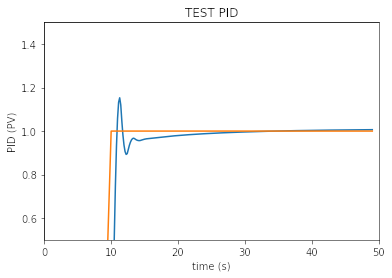

# Simple PID Practical  

## 1. Clone this repo

Remember where you cloned it (maybe best to clone it into your home directory).  

```
cd ~
git clone git@github.com:BWSI-UAV/simple_pid.git
```  

## 2. Implement the PID controller  

Open `simple_pid.py` and edit lines 53, 54, and 57 to calculate your P, I, and D terms (look for *TODO:* in the code).  

## 3. Tune your PID controller

Open the notebook `Implementing PID in Python.ipynb` and tune the "gain" values kP, kI, and kD to generate a reasonable system response (again, look for *TODO:* in the code).  

Try to beat the response shown below and **answer the question** about what makes your response "better".  



## 4. Upload your code to your student repository  

We want to see your PID implementation, your tuned kP, kI, and kD values, and your output response graph.  
